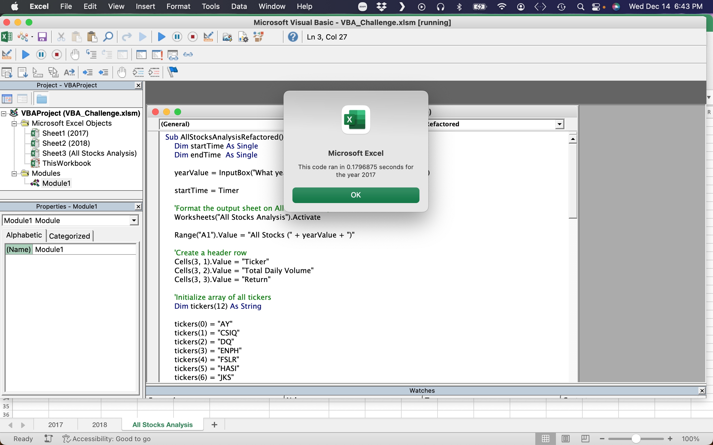

# Green Energy on the Stock Market

## Analysis of green energy stock options

### Overview
This analysis is using VBA macros to parse a collection of data concerning the stock values of selected green energy companies over the span of two separate years and calculating the total return on these stocks in those years. This analysis was done for Steve, who seeks a green energy company to buy into that can be presumed to continue on a profitable trajectory given the history of their stock prices over the two years being analyzed.

### Results
The biggest takeaway for Steve in terms of which stocks he might be comfortable buying into is that 2017 seemed to present a bevy of options, with 9 of the 10 stocks in question having positive net returns for the year, only for 2018 to bring that optimistic outlook down to earth, with only 2 of the 10 seeing positive returns in that year, and only 1 of those 2 increasing it's return value versus 2017.


This suggests that of the options on display here, RUN might be the best option, with only ENPH seeming like a viable alternative.

The code that was written in order to conduct this analysis went through the data and identified the lines which were in reference to each stock ticker in question and stored and displayed data based on each of these stock tickers. This was done by initially creating an array holding all of the stock ticker values as strings.
```
Dim tickers(12) As String
    
    tickers(0) = "AY"
    tickers(1) = "CSIQ"
    tickers(2) = "DQ"
    tickers(3) = "ENPH"
    tickers(4) = "FSLR"
    tickers(5) = "HASI"
    tickers(6) = "JKS"
    tickers(7) = "RUN"
    tickers(8) = "SEDG"
    tickers(9) = "SPWR"
    tickers(10) = "TERP"
    tickers(11) = "VSLR"
```
From there the macro identified the starting and ending lines containing each of the stock tickers, in order, and saved the total volume for the year, the starting price, and the ending price into predefined variables that corresponded to the stock tickers location in the array.
```
Dim tickerVolumes(12) As Long
Dim tickerStartingPrices(12) As Single
Dim tickerEndingPrices(12) As Single
```
```
For i = 0 To 11
    tickerVolumes(i) = 0    
Next i

For i = 2 To RowCount
    tickerVolumes(tickerIndex) = tickerVolumes(tickerIndex) + Cells(i, 8).Value
    
    If Cells(i - 1, 1).Value <> tickers(tickerIndex) And Cells(i, 1).Value = tickers(tickerIndex) Then        
    tickerStartingPrices(tickerIndex) = Cells(i, 6).Value       
    End If
    
    If Cells(i + 1, 1).Value <> tickers(tickerIndex) And Cells(i, 1).Value = tickers(tickerIndex) Then
    tickerEndingPrices(tickerIndex) = Cells(i, 6).Value
    End If

    If Cells(i + 1, 1).Value <> tickers(tickerIndex) Then
    tickerIndex = tickerIndex + 1
    End If

Next i
```
This was an improvement on the original code, which ran through the entire dataset for every variable present in the initial array instead of going in order, which led to increased efficiency of the code. The times went from the values seen below...


...to the much improved times seen here, demonstrating a significant improvement in the efficiency of the code.




### Summary
The advantages of refactoring code are made plain using the relative times of the code being run for the original code and the refactored code. While it may not seem a substantial difference, with both times still falling under a second, when compared the times are actually separated by several orders of magnitude. While that may not be a huge concern in a data set of this size, if extrapolated out into a truly massive set of data it could see an improvement in efficiency that would actually have a noticeable effect on the usability of the code. This example demonstrates how refactoring can generally be used as a tool to improve code, and while it does come at the cost of additional time being spent on what could be already usable and completed code, the returns in efficiency and usability could very easily offset that additional expense on a long enough timeline.
